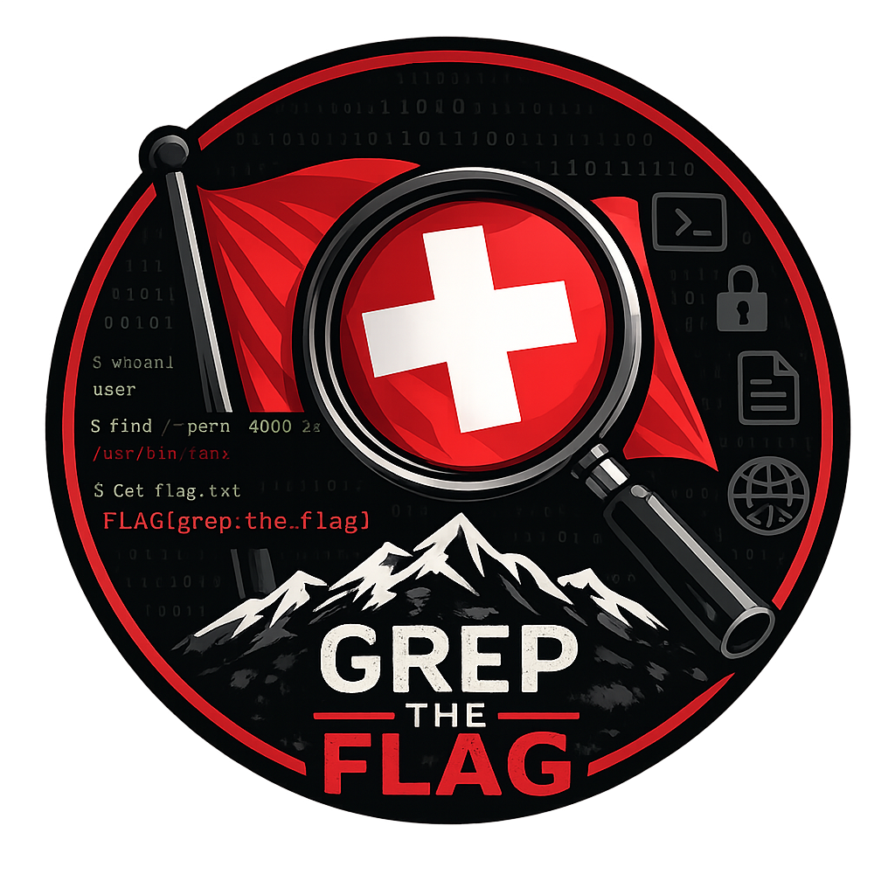

<p align="center">
  
</p>

```
GREP-THE-FLAG(1)               Community Manual               GREP-THE-FLAG(1)
```

## NAME

**grep-the-flag** — find fun in all the wrong directories

## SYNOPSIS

```
grep-the-flag [--players 20..200] [--story EPIC] [--scoring casual|challenge]
              [--theme cyberpunk|fantasy|yours] [--language en|de|yours]
              [--ai-gamemaster on|off] [--fun mandatory]
```

## DESCRIPTION

**grep-the-flag** builds an open-source framework for story-driven CTF and
learning events. You bring 20–200 people; we bring the orchestration, the
leaderboard, an AI gamemaster that gives hints without spoiling, and SSH
keys that appear exactly when you've earned them — and vanish the moment
you haven't.

An event is a story. The story has challenges. The challenges are
minigames: community-built containers that the framework deploys,
provisions, monitors, and tears down — so you can focus on the important
things, like arguing with your team about whose idea it was to `rm` the
flag.

Minigames are **contractually forbidden from implementing authentication**.
Many contributors cite this as their favorite feature.

## OPTIONS (a.k.a. how to contribute)

| Flag | What you build | Start here |
|------|----------------|------------|
| `--minigame` | A challenge, in any language you like. Container in, glory out. | [minigame-template](https://github.com/grep-the-flag/minigame-template) |
| `--event` | A story with challenges. YAML in, epic out. | [event-template](https://github.com/grep-the-flag/event-template) |
| `--theme` | Make it gorgeous. Design tokens only — no JavaScript; we like our sessions unstolen. | [theme-template](https://github.com/grep-the-flag/theme-template) |
| `--language` | Teach the UI your language. ICU syntax, ≥ 95 % of keys, zero HTML. | [language-template](https://github.com/grep-the-flag/language-template) |

All four are GitHub templates: hit **Use this template** and your new repo
is CI-green on the first push. Tests, security scans, keyless signing,
SLSA provenance — all preconfigured. You write the fun part.

## FILES

| Repo | Purpose |
|------|---------|
| [gameframework](https://github.com/grep-the-flag/gameframework) | The core: API, frontend, orchestration, encrypted reward vault. |
| [gameframework-sdk](https://github.com/grep-the-flag/gameframework-sdk) | The law: contracts, schemas, test suites, reusable CI workflows. |
| [gameframework-registry](https://github.com/grep-the-flag/gameframework-registry) | The bouncer: curated catalog of verified community artifacts. Checks IDs (signatures), checks the list (contract tests), and is genuinely nice about it. |

## ENVIRONMENT

```
TDD=mandatory        Red → Green → Refactor. No merge without tests.
                     We are fun at parties. There is a contract test
                     proving it.

SIGNATURES=keyless   Every image ships with SLSA build provenance.
                     Yes, even ours. Especially ours.

GDPR=by-default      After the event, personal data is crypto-shredded.
                     The memories are yours to keep; the SSH keys are not.
```

## EXIT STATUS

```
0     You had fun.
1     You learned something. (Also success.)
42    You solved everything. The AI gamemaster is quietly proud of you.
403   You touched another team's challenge. We saw that.
```

## BUGS

We don't have bugs. We have *incidents*, and during an event they get a
ticket, a status, and a sympathetic admin. Outside of events, open an
issue in the affected repo. First-time contributors get their CI run
approved by a maintainer first — that's a security feature, not distrust.
Okay, it's mild distrust. But of *everyone, equally*.

## SEE ALSO

[gameframework](https://github.com/grep-the-flag/gameframework),
[gameframework-sdk](https://github.com/grep-the-flag/gameframework-sdk),
[gameframework-registry](https://github.com/grep-the-flag/gameframework-registry),
`grep(1)`, `ssh(1)`, and that one teammate who reads the man pages first.

## AUTHORS

The community — and one very persistent human with a vault full of
generated secrets and a strict no-plaintext policy.

---

*This manual page is, of course, covered by tests.*
